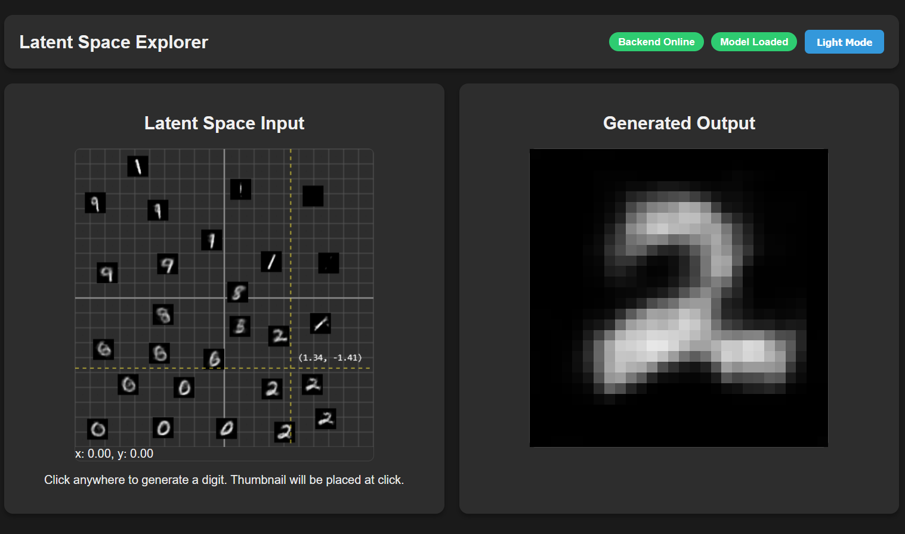
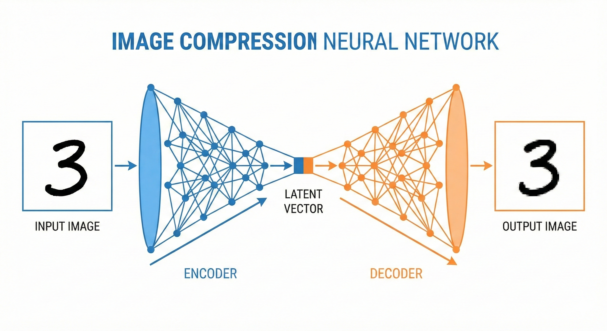
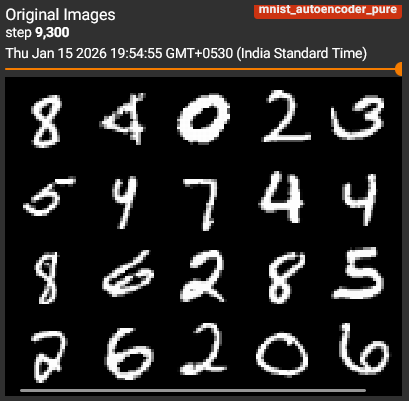
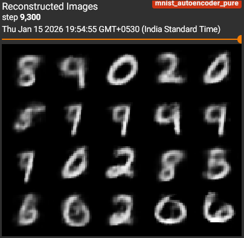

# Latent Space Explorer

**[ACCESS LIVE APP HERE](https://raj-neelam.github.io/MNIST-Autoencoder-Visualization/)** 



## Architecture

*Visual representation of how the Autoencoder compresses input digits into a 2D latent space and reconstructs them.*

## Performance
| Original Input | Reconstructed Output |
| :---: | :---: |
|  |  |
| *Input Digit* | *Model Output* |

## What is this?
The **Latent Space Explorer** is an interactive web application that allows you to explore the "latent space" of a trained Autoencoder model on the MNIST dataset. 

By clicking or hovering over a 2D grid, you can generate 28x28 grayscale images of digits (0-9). The 2D grid represents the compressed representation (latent vector) of the images, effectively letting you visualize how the model "organizes" the concept of handwritten digits.

## How it Works
1.  **Frontend (HTML/JS)**: A 2D coordinate plane allows you to pick an $(x, y)$ point. This point corresponds to a vector in the latent space.
2.  **Backend (FastAPI/PyTorch)**: The $(x, y)$ vector is sent to a backend server.
3.  **Inference (Decoder)**: A trained PyTorch `Decoder` network takes this vector and upscales it back into a 28x28 pixel image.
4.  **Display**: The generated image is sent back to the frontend and displayed in real-time.

## Features
- **Hover-to-Generate**: Move your mouse to see the digit morph in real-time.
- **Click-to-Stamp**: Click to leave a thumbnail of the digit on the grid.
- **Crosshair Navigation**: Precise coordinate tracking.
- **Dark Mode**: Toggle for a premium viewing experience.

## Local Setup

### Prerequisites
- Python 3.10+
- Node.js (Optional, only if you want to use a local server for frontend, but opening index.html works too)

### 1. Clone & Install Backend
```bash
git clone <your-repo-url>
cd manim_maker/backend

# Create virtual environment (optional but recommended)
python -m venv venv
# Windows: venv\Scripts\activate
# Mac/Linux: source venv/bin/activate

# Install dependencies
pip install -r requirements.txt
```

### 2. Setup Model
Ensure you have the trained model weights file `pure_model_weights.pth` placed inside the `backend/` directory.

### 3. Run Backend
```bash
uvicorn main:app --reload
```
The backend will start at `http://localhost:8000`.

### 4. Run Frontend
Simply open `frontend/index.html` in your web browser. 

*Note: Ensure `frontend/script.js` has `backendUrl` set to `http://localhost:8000` for local use.*
